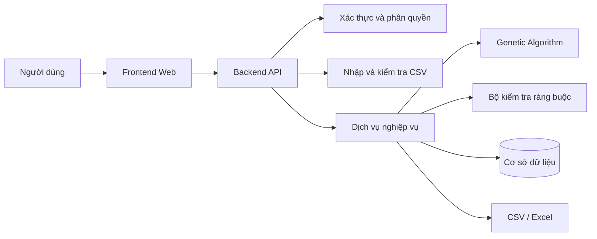

# Ứng dụng lập thời khóa biểu giảng dạy sử dụng thuật toán Di truyền

> **Teaching Timetable Scheduling Application Using Genetic Algorithm**

Ứng dụng web hỗ trợ Phòng đào tạo tự động lập, kiểm tra, theo dõi và điều chỉnh
thời khóa biểu giảng dạy bằng thuật toán Di truyền
(**Genetic Algorithm – GA**).

Dự án được thực hiện trong khuôn khổ thực tập chuyên ngành tại
**Trường Đại học Công Thương Thành phố Hồ Chí Minh**.

---

## Mục lục

- [1. Tổng quan](#1-tổng-quan)
- [2. Mục tiêu](#2-mục-tiêu)
- [3. Người dùng hệ thống](#3-người-dùng-hệ-thống)
- [4. Phạm vi chức năng](#4-phạm-vi-chức-năng)
- [5. Mô hình nghiệp vụ](#5-mô-hình-nghiệp-vụ)
- [6. Loại lớp và khung giờ](#6-loại-lớp-và-khung-giờ)
- [7. Quy tắc phòng học](#7-quy-tắc-phòng-học)
- [8. Lịch học kỳ và ngày nghỉ](#8-lịch-học-kỳ-và-ngày-nghỉ)
- [9. Điều chỉnh thời khóa biểu](#9-điều-chỉnh-thời-khóa-biểu)
- [10. Ràng buộc của bài toán](#10-ràng-buộc-của-bài-toán)
- [11. Mô hình thuật toán Di truyền](#11-mô-hình-thuật-toán-di-truyền)
- [12. Dữ liệu CSV](#12-dữ-liệu-csv)
- [13. Kiến trúc dự kiến](#13-kiến-trúc-dự-kiến)
- [14. Cấu trúc repository](#14-cấu-trúc-repository)
- [15. Tài liệu yêu cầu](#15-tài-liệu-yêu-cầu)
- [16. Quy mô thử nghiệm](#16-quy-mô-thử-nghiệm)
- [17. Công nghệ dự kiến](#17-công-nghệ-dự-kiến)
- [18. Trạng thái dự án](#18-trạng-thái-dự-án)
- [19. Quy trình đóng góp](#19-quy-trình-đóng-góp)
- [20. Thành viên thực hiện](#20-thành-viên-thực-hiện)

---

## 1. Tổng quan

Việc lập thời khóa biểu giảng dạy tại trường đại học phải đồng thời xử lý nhiều
thành phần:

- Phân công giảng viên.
- Danh sách lớp học phần.
- Ngày và khung giờ giảng dạy.
- Loại phòng học.
- Sức chứa phòng.
- Nguyện vọng của giảng viên.
- Thời gian phòng không thể sử dụng.
- Lịch học kỳ và các ngày nghỉ.
- Các yêu cầu điều chỉnh phát sinh.

Khi số lượng giảng viên, lớp học phần và phòng học tăng, việc xếp lịch thủ công
tốn nhiều thời gian và dễ phát sinh xung đột.

Dự án sử dụng thuật toán Di truyền để tìm kiếm phương án thời khóa biểu thỏa
mãn các ràng buộc bắt buộc, đồng thời tối ưu tương đối các tiêu chí về nguyện
vọng giảng viên và hiệu quả sử dụng phòng học.

Hệ thống không thay thế toàn bộ nghiệp vụ quản lý đào tạo. Sản phẩm tập trung
vào ba nhóm chức năng chính:

1. Lập thời khóa biểu tự động.
2. Tra cứu và theo dõi thời khóa biểu.
3. Điều chỉnh lịch có kiểm tra xung đột.

---

## 2. Mục tiêu

### 2.1. Mục tiêu tổng quát

Xây dựng ứng dụng web hỗ trợ lập thời khóa biểu giảng dạy bằng thuật toán Di
truyền trên cơ sở dữ liệu phân công giảng viên, lớp học phần, phòng học, khung
thời gian và các nguyện vọng liên quan.

### 2.2. Mục tiêu cụ thể

- Nhập và kiểm tra dữ liệu từ các tệp CSV.
- Chuẩn hóa dữ liệu trước khi đưa vào thuật toán.
- Cho phép cấu hình các tham số của GA.
- Tự động tạo phương án thời khóa biểu.
- Không chấp nhận phương án vi phạm ràng buộc cứng.
- Đánh giá chất lượng lịch theo các ràng buộc mềm.
- Hiển thị lịch theo giảng viên, phòng và lớp học phần.
- Cho phép Phòng đào tạo điều chỉnh lịch trực tiếp.
- Cho phép giảng viên gửi yêu cầu điều chỉnh.
- Kiểm tra xung đột trước khi áp dụng thay đổi.
- Hỗ trợ lịch học bù được nhập thủ công.
- Xuất kết quả sang CSV và Excel.
- Lưu thông tin các lần chạy để phục vụ đánh giá thực nghiệm.

---

## 3. Người dùng hệ thống

Phiên bản thực tập có hai vai trò vận hành chính.

### 3.1. Phòng đào tạo

Phòng đào tạo có thể:

- Đăng nhập vào hệ thống.
- Nhập và kiểm tra dữ liệu CSV.
- Chọn đợt dữ liệu dùng để chạy thuật toán.
- Cấu hình các tham số GA.
- Thực hiện xếp thời khóa biểu.
- Xem toàn bộ kết quả.
- Xem lịch theo giảng viên, phòng và lớp học phần.
- Chọn một phương án thời khóa biểu để sử dụng.
- Chỉnh sửa lịch trực tiếp.
- Chỉnh sửa lịch theo một khoảng ngày.
- Thêm buổi học bù thủ công.
- Tiếp nhận yêu cầu điều chỉnh của giảng viên.
- Phê duyệt, điều chỉnh hoặc từ chối yêu cầu.
- Xuất kết quả ra CSV hoặc Excel.
- Xem lịch sử chạy và lịch sử thay đổi.

### 3.2. Giảng viên

Giảng viên có thể:

- Đăng nhập vào hệ thống.
- Xem thời khóa biểu cá nhân theo tuần.
- Xem các lớp học phần được phân công.
- Xem chi tiết một buổi dạy.
- Gửi yêu cầu điều chỉnh lịch.
- Theo dõi trạng thái các yêu cầu đã gửi.

Giảng viên không được:

- Tự tạo hoặc xóa lớp học phần.
- Tự sửa trực tiếp lịch chính thức.
- Thay đổi lịch của giảng viên khác.
- Tự phê duyệt yêu cầu của mình.
- Từ chối lớp đã được phân công.
- Thay đổi giảng viên phụ trách lớp học phần.

---

## 4. Phạm vi chức năng

### 4.1. Trong phạm vi

- Ứng dụng web dành cho máy tính.
- Đăng nhập và phân quyền.
- Nhập, xem trước và kiểm tra CSV.
- Quản lý dữ liệu phân công giảng dạy.
- Quản lý giảng viên và nguyện vọng.
- Quản lý lớp học phần.
- Quản lý phòng học và sức chứa.
- Quản lý các khung giờ hợp lệ.
- Quản lý lịch học kỳ và ngày nghỉ.
- Cấu hình và chạy thuật toán Di truyền.
- Hiển thị kết quả theo nhiều góc nhìn.
- Chạy lại thuật toán để tạo phương án mới.
- Chọn phương án thời khóa biểu.
- Chỉnh sửa một buổi học.
- Chỉnh sửa lịch theo khoảng ngày.
- Đổi ngày, tiết hoặc phòng học.
- Gửi và xử lý yêu cầu điều chỉnh.
- Tạm ngưng một buổi khi cần.
- Thêm buổi học bù thủ công.
- Kiểm tra xung đột sau chỉnh sửa.
- Lưu lịch sử thay đổi.
- Xuất CSV và Excel.
- Lưu chỉ số phục vụ đánh giá thuật toán.

### 4.2. Ngoài phạm vi

- Tài khoản sinh viên.
- Đăng ký học phần.
- Quản lý học phí.
- Quản lý điểm.
- Quản lý hồ sơ sinh viên.
- Thời khóa biểu cá nhân của sinh viên.
- Tự động tìm thời gian mà toàn bộ sinh viên đều rảnh.
- Tự động thương lượng lịch bù với sinh viên.
- Tự động phân công giảng viên vào môn học.
- Đánh giá chuyên môn của giảng viên.
- Chia nhóm sinh viên cho lớp thực hành.
- Nhiều giảng viên chính cùng phụ trách một lớp học phần.
- Tự động lựa chọn giảng viên dạy thay.
- Tự động gửi email, SMS hoặc thông báo đẩy.
- Tích hợp đầy đủ với hệ thống quản lý đào tạo của trường.
- Bảo đảm tìm được nghiệm tối ưu toàn cục trong mọi trường hợp.

---

## 5. Mô hình nghiệp vụ

### 5.1. Phân công giảng dạy

Việc phân công giảng viên được thực hiện trước khi xếp thời khóa biểu.

Thuật toán không quyết định giảng viên nào sẽ dạy môn nào.

Các quy tắc đã thống nhất:

- Mỗi lớp học phần có đúng một giảng viên phụ trách chính.
- Một giảng viên có thể dạy nhiều lớp học phần.
- Một giảng viên có thể dạy nhiều lớp của cùng một môn.
- Một giảng viên có thể dạy nhiều môn khác nhau trong cùng học kỳ.
- Một giảng viên có thể dạy các ca liên tiếp.
- Một giảng viên không được dạy các lớp bị chồng thời gian.
- Một lớp thực hành không bị chia thành nhiều nhóm sinh viên.
- Một lớp học phần không có hai giảng viên chính cùng phụ trách.

Ví dụ, một giảng viên có thể được phân công:

| Môn học          | Lớp học phần | Thời gian sau khi xếp |
| ---------------- | ------------ | --------------------- |
| Trí tuệ nhân tạo | AI-01        | Thứ Hai, tiết 1–3     |
| Trí tuệ nhân tạo | AI-02        | Thứ Hai, tiết 4–6     |
| Học máy          | ML-01        | Thứ Ba, tiết 1–3      |
| Học sâu          | DL-01        | Thứ Bảy, tiết 7–9     |

### 5.2. Số buổi học

Trong lịch cơ sở:

- Mỗi lớp học phần có một buổi học cố định mỗi tuần.
- Một học phần có thể kéo dài khoảng 15 tuần.
- Một số tuần có thể không có buổi học do ngày nghỉ.
- Một số tuần có thể có thêm buổi học bù.
- Tổng số buổi hoặc số tiết thực hiện phải đáp ứng yêu cầu học phần.

### 5.3. Lịch cơ sở và buổi học cụ thể

Hệ thống phân biệt:

- **Lịch cơ sở:** quy tắc học lặp lại mỗi tuần.
- **Phân đoạn lịch:** quy tắc có hiệu lực trong một khoảng ngày.
- **Buổi học cụ thể:** một buổi diễn ra vào một ngày xác định.
- **Ngoại lệ:** thay đổi chỉ áp dụng cho một buổi cụ thể.

Ví dụ lịch cơ sở:

```text
Thứ Hai
Tiết 1–3
Phòng A303
```

Sau khi áp dụng lịch học kỳ, hệ thống sinh ra các buổi cụ thể theo ngày.

---

## 6. Loại lớp và khung giờ

Hệ thống hỗ trợ ba loại lớp học phần.

### 6.1. Lý thuyết

Lớp lý thuyết thường học ba tiết trong một buổi.

Các khung giờ dự kiến:

- Tiết 1–3.
- Tiết 4–6.
- Tiết 7–9.
- Tiết 10–12.
- Tiết 13–15.

### 6.2. Thực hành

Lớp thực hành học năm hoặc sáu tiết trong một buổi.

Các khung giờ hợp lệ:

- Tiết 1–5.
- Tiết 1–6.
- Tiết 2–6.

### 6.3. Lý thuyết – thực hành tích hợp

Một lớp tích hợp:

- Là một lớp học phần duy nhất.
- Có một giảng viên phụ trách.
- Dạy lý thuyết và thực hành trong cùng một buổi.
- Học năm hoặc sáu tiết.
- Sử dụng khung giờ giống lớp thực hành.
- Có thể học tại phòng máy, phòng thực hành chuyên ngành hoặc phòng lý thuyết
  tùy dữ liệu của lớp.

Loại phòng yêu cầu phải được khai báo riêng. Hệ thống không được tự suy ra rằng
mọi lớp tích hợp đều bắt buộc học tại phòng máy.

### 6.4. Ngày học

Tất cả các ngày từ Thứ Hai đến Chủ nhật đều có thể được sử dụng để xếp lịch.

Thứ Bảy, Chủ nhật và ca tối không bị xem là thời gian không hợp lệ. Hệ thống có
thể dùng trọng số mềm có thể cấu hình để ưu tiên ngày thường và ban ngày khi
không có nguyện vọng riêng của giảng viên. Nếu giảng viên đã ưu tiên ngày hoặc
khung giờ đó, trọng số mặc định tương ứng không được áp dụng.

Nguyện vọng học cuối tuần phụ thuộc từng giảng viên:

- Có giảng viên ưu tiên ngày thường.
- Có giảng viên ưu tiên Thứ Bảy hoặc Chủ nhật.
- Có giảng viên không có yêu cầu cụ thể.

### 6.5. Không học xuyên ca

Mỗi buổi học phải nằm hoàn toàn trong một khung giờ hợp lệ.

Không tạo các khung tùy ý như:

- Tiết 3–9.
- Tiết 4–10.
- Tiết 5–8.

Lớp học không được kéo dài xuyên qua khoảng nghỉ giữa ca sáng và ca chiều.

---

## 7. Quy tắc phòng học

Mỗi phòng có các thông tin riêng:

- Mã phòng.
- Tên phòng.
- Loại phòng.
- Sức chứa vật lý.
- Trạng thái sử dụng.
- Khoảng thời gian hoặc khung giờ không thể sử dụng.

Một phòng được xem là hợp lệ khi:

- Không bị lớp khác sử dụng cùng thời điểm.
- Đáp ứng loại phòng mà lớp yêu cầu.
- Có sức chứa đủ lớn.
- Được phép sử dụng tại thời điểm được xếp.

### 7.1. Sĩ số dùng để xếp lịch

Hệ thống xác định sĩ số dùng để kiểm tra phòng theo thứ tự:

1. Sĩ số tối đa đã được Phòng đào tạo phê duyệt.
2. Giới hạn đăng ký ban đầu.
3. Sĩ số dự kiến.

Điều kiện bắt buộc:

```text
room_capacity >= scheduling_student_count
```

Phòng đào tạo không được tăng giới hạn đăng ký vượt sức chứa vật lý của phòng
đang sử dụng.

### 7.2. Phòng tiêu chuẩn và phòng lớn

Đa số phòng học hoặc phòng máy có sức chứa khoảng 60 sinh viên.

Một số phòng lớn có thể chứa khoảng 130 sinh viên.

Phòng lớn:

- Không bị giới hạn riêng cho các môn đại cương.
- Có thể sử dụng cho mọi lớp tương thích.
- Có thể được sử dụng khi các phòng tiêu chuẩn đã hết.
- Có thể được Phòng đào tạo lựa chọn khi điều chỉnh hoặc xếp lịch bù.

Khi tự động xếp lịch, thuật toán nên ưu tiên phòng có sức chứa gần với sĩ số
lớp để tránh lãng phí.

Ví dụ:

| Sĩ số | Phòng | Sức chứa | Kết quả                         |
| ----: | ----- | -------: | ------------------------------- |
|    50 | A303  |       60 | Hợp lệ và được ưu tiên          |
|    50 | F201  |      130 | Hợp lệ nhưng có thể bị phạt mềm |
|    65 | A303  |       60 | Không hợp lệ                    |
|   100 | F201  |      130 | Hợp lệ                          |

Việc sử dụng phòng lớn cho lớp nhỏ là một vấn đề tối ưu mềm, không phải lỗi bắt
buộc.

Hệ thống không kiểm tra thời gian di chuyển giữa các phòng hoặc tòa nhà vì các
khung giờ chính thức đã có thời gian chuyển tiết phù hợp.

---

## 8. Lịch học kỳ và ngày nghỉ

Hệ thống sử dụng ngày thực tế và bảng lịch học kỳ.

Lịch học kỳ có thể chứa:

- Ngày bắt đầu học kỳ.
- Ngày kết thúc học kỳ.
- Số tuần học.
- Ngày giảng dạy.
- Ngày lễ.
- Ngày không tổ chức học.
- Ghi chú.

Khi lịch cơ sở rơi vào ngày lễ:

- Không sinh một buổi học bình thường cho ngày đó.
- Không tự động đánh dấu là `Tạm ngưng`.
- Ngày đó được để trống hoặc hiển thị là ngày nghỉ.
- Hệ thống ghi nhận lớp có thể còn thiếu một buổi.
- Phòng đào tạo có thể thêm lịch bù thủ công sau.

Ví dụ:

```text
Số buổi yêu cầu: 15
Số buổi lịch thường đã tạo: 14
Số buổi cần bù: 1
```

Hệ thống không tự động chuyển buổi bị trùng ngày lễ sang tuần kế tiếp.

---

## 9. Điều chỉnh thời khóa biểu

Hệ thống hỗ trợ hai cách điều chỉnh.

### 9.1. Phòng đào tạo chỉnh trực tiếp

Giảng viên có thể liên hệ Phòng đào tạo ngoài hệ thống.

Phòng đào tạo đăng nhập và trực tiếp:

- Chọn lớp hoặc buổi học.
- Chọn phạm vi thay đổi.
- Đổi ngày.
- Đổi khung giờ.
- Đổi phòng.
- Nhập lý do.
- Kiểm tra xung đột.
- Xác nhận áp dụng.

### 9.2. Giảng viên gửi yêu cầu trên web

Giảng viên có thể:

- Chọn lớp học phần được phân công.
- Chọn buổi hoặc lịch bị ảnh hưởng.
- Chọn loại yêu cầu.
- Nhập lý do.
- Đề xuất ngày, tiết hoặc phòng mới.
- Gửi yêu cầu.
- Theo dõi trạng thái xử lý.

Yêu cầu không làm thay đổi lịch chính thức ngay sau khi gửi.

Phòng đào tạo có thể:

- Xem chi tiết yêu cầu.
- Kiểm tra xung đột.
- Sửa phương án được đề xuất.
- Phê duyệt.
- Từ chối và ghi lý do.
- Áp dụng thay đổi.

Các trạng thái dự kiến:

- `PENDING`: Chờ duyệt.
- `APPROVED`: Đã phê duyệt.
- `REJECTED`: Bị từ chối.
- `CANCELLED`: Đã hủy.
- `APPLIED`: Đã áp dụng.

### 9.3. Phạm vi chỉnh sửa

Phòng đào tạo có thể chọn:

- Chỉ một buổi cụ thể.
- Một khoảng ngày.
- Từ một ngày đến hết học phần.
- Toàn bộ lịch cố định trước mốc khóa nghiệp vụ.

### 9.4. Phân đoạn lịch

Một lớp học phần có thể sử dụng phòng khác nhau trong các khoảng ngày khác nhau.

Ví dụ:

```text
01/09/2026–15/10/2026
Thứ Hai, tiết 1–3, phòng A303

16/10/2026–20/12/2026
Thứ Hai, tiết 1–3, phòng F201
```

Trong phiên bản ban đầu:

- GA tạo một lịch cơ sở cho toàn học phần.
- Phòng đào tạo có thể tách lịch thành các phân đoạn thủ công.
- GA chưa cần tự động tạo nhiều phân đoạn phòng.

### 9.5. Học bù

Phòng đào tạo có thể thêm một buổi học bù thủ công.

Hệ thống chỉ cần kiểm tra:

- Giảng viên không bị trùng lịch.
- Phòng không bị trùng lịch.
- Phòng đúng loại.
- Phòng đủ sức chứa.
- Khung giờ hợp lệ.
- Ngày học nằm trong phạm vi được phép.

Việc xác định thời gian mà toàn bộ sinh viên đều rảnh được giải quyết bên ngoài
ứng dụng.

---

## 10. Ràng buộc của bài toán

### 10.1. Ràng buộc cứng

Một phương án không hợp lệ khi:

- Một giảng viên dạy hai lớp bị chồng thời gian.
- Một phòng được sử dụng cho hai lớp bị chồng thời gian.
- Lớp không có lịch cơ sở.
- Khung giờ không thuộc danh sách hợp lệ.
- Độ dài khung giờ không phù hợp với loại lớp.
- Phòng không đúng loại yêu cầu.
- Sức chứa phòng nhỏ hơn sĩ số dùng để xếp lịch.
- Phòng không hoạt động hoặc không thể sử dụng tại thời điểm được xếp.
- Vi phạm một hạn chế cố định đã được giảng viên xác nhận.
- Thiếu thông tin lớp, giảng viên, phòng hoặc khung giờ.
- Hai phân đoạn tạo ra lịch mâu thuẫn cho cùng một buổi.
- Một thay đổi thủ công tạo thêm xung đột mới.

Vi phạm cứng phải được từ chối hoặc nhận mức phạt đủ lớn để không được lựa chọn.

### 10.2. Ràng buộc mềm

Các tiêu chí tối ưu có thể bao gồm:

- Ưu tiên ngày dạy mong muốn của giảng viên.
- Ưu tiên khung giờ mong muốn.
- Hạn chế ngày hoặc khung giờ không mong muốn.
- Hạn chế khoảng trống dài giữa các ca.
- Gom lịch của giảng viên vào số ngày hợp lý.
- Phân bố lịch tương đối cân bằng.
- Ưu tiên phòng có sức chứa gần với sĩ số lớp.
- Hạn chế sử dụng phòng lớn cho lớp nhỏ khi vẫn còn phòng tiêu chuẩn.
- Giữ lịch cơ sở ổn định.

Ưu tiên ngày thường và ban ngày bằng trọng số mềm có thể cấu hình; Thứ Bảy,
Chủ nhật và ca tối vẫn là lựa chọn hợp lệ. Nguyện vọng cụ thể của giảng viên
được ưu tiên hơn trọng số mặc định này.

Việc dạy các ca liên tiếp không bị xem là lỗi nếu không có xung đột.

---

## 11. Mô hình thuật toán Di truyền

### 11.1. Biểu diễn cá thể

Một cá thể đại diện cho một phương án thời khóa biểu.

Trong phiên bản MVP:

- Một gene đại diện cho lịch cơ sở của một lớp học phần.
- Số gene xấp xỉ số lớp học phần.
- Không sử dụng một gene riêng cho từng ngày học cụ thể.

Ví dụ gene:

```text
section_code = AI-01
lecturer_code = GV001
day_of_week = MONDAY
slot_code = LT_01_03
room_code = A301
```

Các trường cố định:

- Mã lớp học phần.
- Mã môn học.
- Giảng viên phụ trách.
- Loại lớp.
- Số tiết mỗi buổi.
- Loại phòng yêu cầu.
- Sĩ số dùng để xếp lịch.

Các trường do GA lựa chọn:

- Ngày học.
- Khung giờ.
- Phòng học.

### 11.2. Các thành phần GA

Thuật toán dự kiến gồm:

- Khởi tạo quần thể.
- Hàm đánh giá.
- Selection.
- Crossover.
- Mutation.
- Repair.
- Elitism.
- Điều kiện dừng.
- Lưu nghiệm tốt nhất.

### 11.3. Hàm đánh giá

Có thể sử dụng mô hình chi phí:

```text
Total Cost
= Hard Constraint Cost
+ Lecturer Preference Cost
+ Timetable Gap Cost
+ Room Waste Cost
+ Distribution Cost
```

Phương án có vi phạm cứng không được xếp trên phương án hợp lệ chỉ vì có điểm
mềm tốt hơn.

Kết quả đánh giá nên cung cấp:

- Số vi phạm cứng.
- Danh sách vi phạm cứng.
- Tổng chi phí mềm.
- Chi tiết điểm theo từng nhóm.
- Fitness hoặc Cost.
- Thời gian chạy.
- Số thế hệ.
- Seed ngẫu nhiên.

### 11.4. Tính tái lập

Mỗi lần chạy nên lưu:

- Population size.
- Number of generations.
- Crossover rate.
- Mutation rate.
- Trọng số ràng buộc mềm.
- Seed.
- Giới hạn thời gian.
- Phiên bản dữ liệu đầu vào.
- Kết quả tốt nhất.

Cùng dữ liệu, cấu hình, seed và phiên bản mã nguồn nên cho kết quả có thể tái
lập hoặc tương đương có ý nghĩa.

---

## 12. Dữ liệu CSV

Nhóm tự thiết kế cấu trúc CSV cho dự án.

Quy ước mặc định:

- Mã hóa UTF-8.
- Phân cách bằng dấu phẩy.
- Có dòng tiêu đề.
- Tên cột được tài liệu hóa rõ.
- Mã định danh phải ổn định và duy nhất.
- Ngày sử dụng một định dạng thống nhất.
- Không tự động bỏ qua dữ liệu sai.

Các nhóm dữ liệu dự kiến:

- Giảng viên.
- Nguyện vọng giảng viên.
- Phân công giảng dạy.
- Lớp học phần.
- Phòng học.
- Khung giờ.
- Lịch học kỳ.
- Thời gian phòng không sử dụng.
- Hạn chế cố định của giảng viên.
- Phân đoạn lịch, nếu được nhập.
- Yêu cầu điều chỉnh, nếu cần nhập hoặc xuất.

Lỗi CSV phải chỉ rõ:

- Tên tệp.
- Dòng.
- Cột.
- Giá trị sai.
- Nguyên nhân.

Không sử dụng dữ liệu sinh viên thật trong các tệp mẫu.

Dữ liệu thử nghiệm phải là dữ liệu giả lập hoặc đã được ẩn danh.

---

## 13. Kiến trúc dự kiến



Nguyên tắc kiến trúc:

- Frontend không phải nơi quyết định nghiệp vụ cuối cùng.
- Backend kiểm tra quyền và dữ liệu.
- GA không phụ thuộc HTTP hoặc giao diện.
- GA không đọc trực tiếp CSV.
- GA không truy cập trực tiếp cơ sở dữ liệu.
- Dữ liệu phải được chuẩn hóa trước khi truyền vào thuật toán.
- Bộ kiểm tra ràng buộc nên được dùng chung cho GA và chỉnh sửa thủ công.
- Không nhân bản cùng một quy tắc nghiệp vụ ở nhiều nơi.

---

## 14. Cấu trúc repository

```text
timetable-ga/
├── .github/
│   └── pull_request_template.md
├── backend/
│   ├── AGENTS.md
│   └── app/
│       └── algorithms/
│           ├── AGENTS.md
│           └── genetic/
│               └── AGENTS.md
├── data/
│   └── samples/
│       └── README.md
├── docs/
│   └── requirements/
│       ├── TaiLieu_UR_cap_nhat_0.2.docx
│       └── TaiLieu_SRS_cap_nhat_0.3.docx
├── frontend/
│   └── AGENTS.md
├── .env.example
├── .gitignore
├── AGENTS.md
├── CONTRIBUTING.md
└── README.md
```

Các file `AGENTS.md` chứa hướng dẫn dành cho Codex và các AI coding agents.

Quy tắc ưu tiên:

1. Đọc `AGENTS.md` ở thư mục gốc.
2. Đọc `AGENTS.md` gần nhất với file đang sửa.
3. Hướng dẫn ở thư mục gần hơn được ưu tiên khi có khác biệt.

---

## 15. Tài liệu yêu cầu

Các tài liệu nghiệp vụ chính được lưu tại:

- `docs/requirements/TaiLieu_UR_cap_nhat_0.2.docx`
- `docs/requirements/TaiLieu_SRS_cap_nhat_0.3.docx`

Trong đó:

- **URS** mô tả nhu cầu và mong muốn của người dùng.
- **SRS** mô tả yêu cầu chức năng, dữ liệu, ràng buộc và tiêu chí chấp nhận.

Khi tài liệu và mã nguồn có khác biệt:

1. Kiểm tra phiên bản tài liệu mới nhất.
2. Không tự suy diễn nghiệp vụ.
3. Cập nhật tài liệu trước hoặc đồng thời với code.
4. Bổ sung kiểm thử cho quy tắc bị thay đổi.

---

## 16. Quy mô thử nghiệm

Quy mô ban đầu:

- Khoảng 20 giảng viên.
- Khoảng 100–200 lớp học phần.
- Khoảng một gene cho mỗi lớp học phần.
- Khoảng 15 buổi cụ thể cho mỗi lớp trong một học kỳ.
- Khoảng 1.500–3.000 buổi học cụ thể sau khi mở rộng theo lịch học kỳ.

Các mức thử nghiệm:

| Mức     | Quy mô gợi ý                  | Mục đích                  |
| ------- | ----------------------------- | ------------------------- |
| Rất nhỏ | 2–5 giảng viên, 5–20 lớp      | Kiểm tra bằng tay         |
| Ban đầu | 20 giảng viên, 100–200 lớp    | Tinh chỉnh và đánh giá GA |
| Mở rộng | Dữ liệu sinh lớn hơn          | Đánh giá khả năng mở rộng |
| Thực tế | Dữ liệu được cho phép sử dụng | Đánh giá cuối cùng        |

Không bắt đầu phát triển bằng tập dữ liệu quá lớn khi các quy tắc và thuật toán
chưa được kiểm thử đầy đủ.

---

## 17. Công nghệ dự kiến

Công nghệ có thể được điều chỉnh trong quá trình triển khai, miễn là không làm
thay đổi yêu cầu nghiệp vụ.

### Backend

- Python.
- FastAPI.
- SQLAlchemy.
- Pydantic.
- pytest.

### Frontend

- React.
- TypeScript.
- Thư viện gọi API và quản lý trạng thái phù hợp.
- Framework kiểm thử frontend phù hợp.

### Cơ sở dữ liệu

- PostgreSQL.

### Thuật toán

- Python.
- Genetic Algorithm.
- Các kỹ thuật hỗ trợ như repair và heuristic.

### Triển khai

- Docker.
- Docker Compose.
- Git và GitHub.

Không đưa khóa bí mật, mật khẩu hoặc thông tin kết nối thật vào repository.

---

## 18. Trạng thái dự án

Dự án hiện đang ở giai đoạn:

- Làm rõ yêu cầu nghiệp vụ.
- Hoàn thiện URS và SRS.
- Khởi tạo cấu trúc repository.
- Chuẩn hóa quy trình Git và Pull Request.
- Chuẩn bị thiết kế dữ liệu mẫu.
- Chuẩn bị thiết kế backend, frontend và thuật toán.

Các lệnh cài đặt và chạy hệ thống sẽ được bổ sung sau khi cấu trúc backend và
frontend được khởi tạo.

Không sử dụng các lệnh cài đặt chưa được xác nhận hoặc chưa tồn tại trong
repository.

---

## 19. Quy trình đóng góp

Trước khi thay đổi code:

1. Cập nhật nhánh `main`.
2. Tạo branch mới.
3. Đọc tài liệu URS/SRS liên quan.
4. Đọc file `AGENTS.md` gần nhất.
5. Thực hiện thay đổi trong đúng phạm vi.
6. Thêm hoặc cập nhật kiểm thử.
7. Kiểm tra không có dữ liệu nhạy cảm.
8. Tạo commit rõ ràng.
9. Push branch.
10. Mở Pull Request vào `main`.
11. Nhờ thành viên khác review.
12. Chỉ merge sau khi đã kiểm tra.

Quy ước branch:

```text
feature/TKB-xxx-description
fix/TKB-xxx-description
docs/TKB-xxx-description
test/TKB-xxx-description
refactor/TKB-xxx-description
chore/TKB-xxx-description
```

Ví dụ:

```text
feature/TKB-010-csv-import
fix/TKB-021-room-conflict
docs/TKB-002-update-requirements
test/TKB-030-ga-overlap-tests
```

Quy ước commit gợi ý:

```text
feat: add CSV preview
fix: detect partial period overlap
docs: update scheduling requirements
test: add room capacity validation tests
refactor: separate timetable constraint services
chore: initialize frontend structure
```

Xem hướng dẫn đầy đủ tại [`CONTRIBUTING.md`](CONTRIBUTING.md).

---

## 20. Thành viên thực hiện

| Thành viên           | Mã số sinh viên |
| -------------------- | --------------- |
| Đoàn Lê Thanh Phi    | 2001230657      |
| Lê Quốc Huy          | 2001230309      |
| Nguyễn Thị Đông Tiền | 2001230797      |

**Giảng viên hướng dẫn:** Th.S Đinh Nguyễn Trọng Nghĩa

**Đơn vị:** Trường Đại học Công Thương Thành phố Hồ Chí Minh

---

## Lưu ý

Dự án phục vụ mục đích học tập, nghiên cứu và đánh giá trong kỳ thực tập.

Không sử dụng dữ liệu cá nhân thật, dữ liệu sinh viên chưa được phép công bố
hoặc thông tin nội bộ nhạy cảm trong repository.
